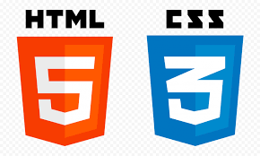
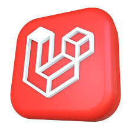

### Hi👋 I'm WASIU SAMAD AYOMIDE

"I am an accomplished Full-Stack Software Developer with a mastery of advanced programming languages. I possess a strong work ethic and am committed to continuous learning, having successfully contributed to numerous projects that have honed my skills and expanded my knowledge base. My expertise extends beyond computer programming languages.

Experienced in HTML || SASS/TAILWIND/CSS/Bootstrap || PHP || OBJECT ORIENTED (OOP) || LARAVEL 9/API || AJAX || MYSQL DATABASE || JAVASCRIPT/TYPESCRIPT...

MY SKILLS

  

🔭 A Student of GigsTech Solutions & Consults

🔭 I’m currently on Laravel

🛠 I’m currently learning Laravel 9

👯 I’m looking to collaborate on Blog

💬 Ask me about Laravel or any tech related stuff.

💛 What you Love doing: I love working in a team and Build Interactive Projects 👊

Sport: :football: Football 🎾 Tennis

😄 Pronouns: He/She

⚡😊 Fun fact: I spend 12 hours developing a 3 Days Project.

My top languages
ADVANTAGE! ADVANTAGE!! ADVANTAGE!!!
